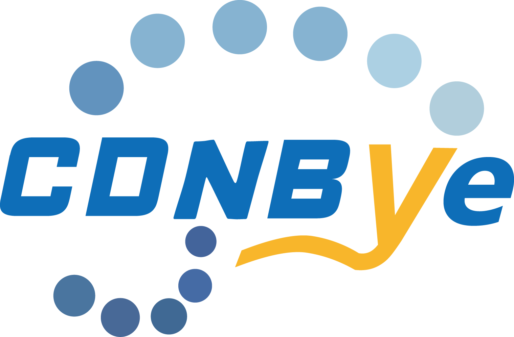

<h1 align="center"><a href="" target="_blank" rel="noopener noreferrer"></a></h1>
<h4 align="center">It's time to say bye to CDN.</h4>


**[中文](docs/中文/README_CH.md)**

This JS library implements [WebRTC](https://en.wikipedia.org/wiki/WebRTC) datachannel to scale live/vod video streaming by peer-to-peer network using bittorrent-like protocol. Powered by [hls.js](https://github.com/video-dev/hls.js), it can play HLS on any platform with many popular HTML5 players such as video.js, Clappr and Flowplayer. This library is a part of CDNBye project which attempts to deliver high quality video streams, decreasing the number of requests to CDN servers, reducing the cost of transmission and enhancing system’s scalability. As the name suggests, CDNBye will help you offload bandwidth from expensive traditional CDNs，while also maximizing a user’s viewing experience.

## Playground
coming soon...

## Quick Start
Put the [quick-start.html](demo/quick-start.html) in your web page, run it. Wait for a few seconds，then open the same page from another browser(the receiver). Now you have a direct P2P connection between two browsers without plugin!
The first web peer will serve as a seed, if no one else in the same channel.

## Browser Support
WebRTC has already been incorporated into the HTML5 standard and it is broadly deployed in modern browsers.

 Browser|Chrome | Firefox | Safari | Opera | IE | Edge|   
:-: | :-: | :-: | :-: | :-: | :-: | :-:
Support | Yes | Yes | Yes | Yes | No | No 

## Installation

#### Pre-built Script
Include the latest version bundled with hls.js(recommended): 
```javascript
<script src="https://cdn.jsdelivr.net/npm/cdnbye@latest"></script>
```
Or include the latest version without hls.js:
```javascript
<script src="https://cdn.jsdelivr.net/npm/cdnbye@latest/dist/hlsjs-p2p-engine.min.js"></script>
```

#### Via NPM
```
cd yourProject && npm install cdnbye --save
```
In your application import/require the package you want to use as the following examples:
```javascript
import Hls from 'cdnbye/src/index.hls';   // the package with hls.js
```
Or 
```javascript
import CDNBye from 'cdnbye/dist/hlsjs-p2p-engine';   // the package without hls.js
```

## Usage
#### Bundle
Add p2pConfig as a property of hlsjsConfig, then Create hls.js instance passing hlsjsConfig as constructor param.
```javascript
var hlsjsConfig = {
    debug: true,
    // Other hlsjsConfig options provided by hls.js
    p2pConfig: {
        logLevel: 'debug',
        // Other p2pConfig options if applicable
    }
};
// Hls constructor is overriden by included bundle
var hls = new Hls(hlsjsConfig);
// Use `hls` just like the usual hls.js ...
```
#### Engine(the library without hls.js)
Create hls.js instance passsing hlsjsConfig as param. Create CDNbye instance passing hls.js instance and p2pConfig as params. Call hls.js loadSource and attachMedia methods.
```javascript
var hlsjsConfig = {
    maxBufferSize: 0,       // Highly recommended setting
    maxBufferLength: 30,    // Highly recommended setting
    liveSyncDuration: 30    // Highly recommended setting
};

var p2pConfig = {
    logLevel: 'debug',
    // Other p2pConfig options if applicable
};

var hls = new Hls(hlsjsConfig);
var p2pEngine = new CDNbye(hls, p2pConfig);        // Key step

// Use `hls` just like your usual hls.js…
hls.loadSource(contentUrl);
hls.attachMedia(video);
hls.on(Hls.Events.MANIFEST_PARSED,function() {
    video.play();
});
```

## API and Configuration
See [API.md](docs/English/API.md)

## Design
See [design.md](docs/English/design.md)

## FAQ
We have collected some [frequently asked questions](docs/English/FAQ.md). Before reporting an issue, please search if the FAQ has the answer to your problem.

## Player integration
coming soon...

## Donation
If you find CDNBye useful, you can buy me a cup of coffee :)<br>


